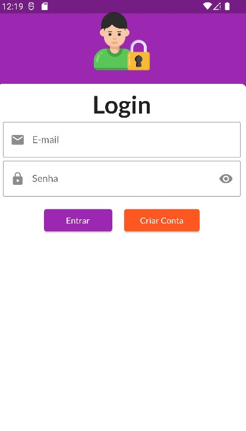
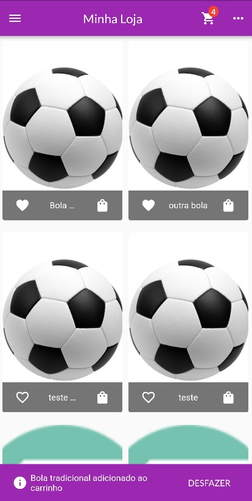
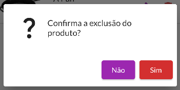
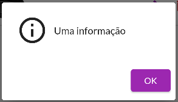

# Exemplo de Crud com Firebase

Projeto 100% funciona!

Para testá-lo é necessário criar uma conta gratuíta em https://firebase.google.com/ e preencher os dados do projeto criado em: /lib/data/firebase_consts.dart.

<center>
<table>
<tr>
<td>

</td>
<td>
 
</td>
<td>

</td>
</tr>
</table>
</center>


Possui também uma classe customizada para mensagens de confirmação e exclusão.

<center>
<table>
<tr>
<td>

</td>
<td>
 
</td>
</tr>
</table>
</center>

```dart
import 'package:flutter/material.dart';

class CustomDialog {
  final BuildContext context;

  CustomDialog(this.context);

  Future<bool?> errorMessage({required String message}) {
    return _dialog(
      message: message,
      yesButtonText: "OK",
      yesButtonValue: false,
      noButtonText: '',
      icon: Icon(
        Icons.error_outline,
        size: 50,
        color: Theme.of(context).colorScheme.error,
      ),
    );
  }

  Future<bool?> confirmationDialog({required String message, bool yesButtonHighlight = false}) {
    return _dialog(
      message: message,
      yesButtonText: "Sim",
      noButtonText: 'Não',
      yesButtonColor: yesButtonHighlight == true ? Theme.of(context).colorScheme.error : null,
      icon: const Icon(Icons.question_mark, size: 50),
    );
  }

  Future<bool?> informationDialog({required String message}) {
    // A cor do botão deve ser passada em branco para assumir a cor do tema
    // noButtonText deve ser deixado em branco para que não seja exibido
    return _dialog(
      message: message,
      yesButtonText: "OK",
      noButtonText: '',
      icon: const Icon(Icons.info_outline, size: 50),
    );
  }

  Future<bool?> _dialog({
    required String message,
    required String yesButtonText,
    required String noButtonText,
    bool? yesButtonValue = true,
    Color? yesButtonColor,
    Icon? icon,
  }) {
    Color yesBtnColor = yesButtonColor ?? Theme.of(context).colorScheme.primary;

    return showDialog<bool>(
      context: context,
      builder: (ctx) => AlertDialog(
        content: Row(
          children: [
            // se o ícone não foi informado retorna um container em branco
            icon ?? Container(),
            // se tiver um ícone coloca um sizedbox para dar um espaço entre ele e o texto
            icon != null ? const SizedBox(width: 10) : Container(),
            // fliexible faz a quebra do texto em mensagens muito grandes
            Flexible(child: Text(message)),
          ],
        ),
        actions: [
          // só exibe o botão não se o texto foi informado.
          if (noButtonText != '')
            ElevatedButton(
              onPressed: () => Navigator.of(ctx).pop(false),
              child: Text(noButtonText),
            ),
          ElevatedButton(
            onPressed: () => Navigator.of(ctx).pop(yesButtonValue),
            style: ButtonStyle(backgroundColor: MaterialStateProperty.all(yesBtnColor)),
            child: Text(yesButtonText),
          )
        ],
      ),
    );
  }
}

```

